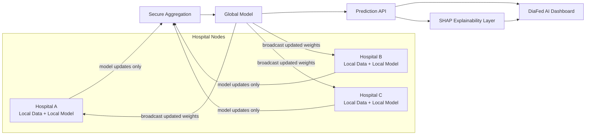

<div align="center">

# 🩺 DiaFed AI

### Explainable Federated Learning for Early Diabetes Prediction

*A privacy-preserving AI platform where multiple hospitals collaboratively train diabetes prediction models — without ever sharing raw patient data.*

[](https://shruta99-cse.github.io/DiaFed-AI/)
[](#)
[](#-license)
[](#-disclaimer)

<a href="https://shruta99-cse.github.io/DiaFed-AI/"><strong>🔗 View Live Demo</strong></a>
·
<a href="#-getting-started"><strong>⚙️ Setup Guide</strong></a>
·
<a href="#-features"><strong>✨ Features</strong></a>
·
<a href="#-disclaimer"><strong>⚠️ Disclaimer</strong></a>

</div>

<br/>

## 📑 Table of Contents

<details open>
<summary>Click to expand / collapse</summary>

- [Overview](#-overview)
- [Problem Statement](#-problem-statement)
- [Proposed Solution](#-proposed-solution)
- [Architecture](#-architecture)
- [Explainable AI (SHAP)](#-explainable-ai-shap)
- [Machine Learning Models](#-machine-learning-models)
- [Tech Stack](#-tech-stack)
- [Features](#-features)
- [Screenshots](#-screenshots)
- [Getting Started](#-getting-started)
- [API Configuration](#-api-configuration)
- [Deployment (GitHub Pages)](#-deployment-github-pages)
- [Research Objective](#-research-objective)
- [Disclaimer](#-disclaimer)
- [License](#-license)

</details>

<br/>

## 🔎 Overview

**DiaFed AI** explores whether hospitals can collaboratively build an accurate diabetes-risk prediction model **without pooling patient records into one place**. Instead of centralizing sensitive data, each participating hospital trains a local model on its own patients; only model updates (not raw data) are shared and aggregated into a global model.

> This is a research / academic project. It demonstrates federated learning and explainable AI concepts and is **not** a certified medical device.

<br/>

## 🧩 Problem Statement

<details>
<summary><strong>Why this project exists</strong></summary>
<br/>

- Diabetes is a growing global health burden, and early risk detection significantly improves outcomes.
- Training a strong ML model needs data from many hospitals — but patient data is sensitive, regulated, and legally difficult to centralize (HIPAA/DPDP-style constraints).
- Most existing diabetes-prediction demos train on a single public dataset (e.g. PIMA) in isolation, which doesn't reflect how real multi-hospital collaboration would need to work.
- Even when a model makes a prediction, clinicians and patients need to understand **why** — a black-box score alone isn't useful or trustworthy.

</details>

<br/>

## 💡 Proposed Solution

<details>
<summary><strong>How DiaFed AI addresses it</strong></summary>
<br/>

1. **Federated Learning** — each hospital node trains locally on its own patient data; only model weights/updates are sent to a central aggregator to build a shared global model.
2. **Explainable AI (SHAP)** — every prediction ships with a feature-contribution breakdown, so the "why" behind a risk score is visible, not hidden.
3. **Multi-hospital simulation dashboard** — a SaaS-style interface to visualize hospital nodes, training rounds, aggregation, and model performance over time.
4. **Clear separation of demo vs. real data** — when a live backend/model endpoint isn't connected, the UI clearly labels results as simulated/demo data rather than presenting them as real medical output.

</details>

<br/>

## 🏗️ Architecture



*Note: label this as a **Federated Learning Simulation** in the UI unless secure aggregation is actually implemented server-side — see [Disclaimer](#-disclaimer).*

<br/>

## 🧠 Explainable AI (SHAP)

<details>
<summary><strong>What the Explainability panel shows</strong></summary>
<br/>

Every prediction includes a **"Why this prediction?"** breakdown showing each input feature's contribution (positive or negative) toward the predicted risk — e.g. Glucose, BMI, Age, Diabetes Pedigree Function, Blood Pressure, Insulin — rendered as horizontal contribution bars with a short plain-language summary.

If a real backend SHAP endpoint is connected, the panel uses live values; otherwise it's clearly labeled as an **AI-generated research explanation** using demo data.

</details>

<br/>

## 🤖 Machine Learning Models

| Model | Role |
|---|---|
| Federated Neural Network | Primary federated model |
| Logistic Regression | Interpretable baseline |
| Random Forest | Ensemble comparison |
| Support Vector Machine | Comparison model |
| Centralized Baseline | Non-federated reference point |

Compared on **Accuracy, Precision, Recall, F1 Score, and ROC-AUC**.

<br/>

## 🛠️ Tech Stack

<details>
<summary><strong>Expand for the full stack</strong></summary>
<br/>

> ✏️ Fill in / adjust this table to match what's actually in the repo.

| Layer | Technology |
|---|---|
| Frontend | React (Vite) |
| Styling | Tailwind CSS |
| Icons | Lucide React |
| Charts | Recharts |
| Routing | React Router |
| Backend | _(e.g. FastAPI / Flask / Node — update to match)_ |
| ML | _(e.g. scikit-learn / PyTorch — update to match)_ |
| Deployment | GitHub Pages |

</details>

<br/>

## ✨ Features

- 📊 SaaS-style dashboard with live-feeling stats and trend indicators
- 🩸 Patient risk prediction workflow with input validation
- 🧠 SHAP-based explainability for every prediction
- 🏥 Federated learning simulation across multiple hospital nodes
- 📈 Model performance comparison across 5 algorithms
- 🗂️ Patient records table with search, filter, sort, pagination
- 📜 Activity log / audit trail
- 🌗 Light theme by default, optional dark mode
- 📱 Fully responsive — desktop, tablet, and mobile

<br/>

## 🖼️ Screenshots

<details>
<summary><strong>Click to expand</strong></summary>
<br/>

| Dashboard | Prediction | Explainability |
|---|---|---|
| _add screenshot_ | _add screenshot_ | _add screenshot_ |

</details>

<br/>

## 🚀 Getting Started

<details>
<summary><strong>1. Clone the repository</strong></summary>

```bash
git clone https://github.com/shruta99-cse/DiaFed-AI.git
cd DiaFed-AI
```
</details>

<details>
<summary><strong>2. Frontend setup</strong></summary>

```bash
npm install
npm run dev
```
</details>

<details>
<summary><strong>3. Backend setup</strong></summary>

> ✏️ Update this with your actual backend run instructions (e.g. Python virtualenv + `uvicorn` / `flask run`).

```bash
cd backend
pip install -r requirements.txt
python app.py
```
</details>

<details>
<summary><strong>4. Build for production</strong></summary>

```bash
npm run build
```
</details>

<br/>

## 🔌 API Configuration

The frontend reads the backend URL from an environment variable rather than hardcoding it:

```bash
# .env
VITE_API_URL=https://your-backend-url.example.com
```

If `VITE_API_URL` is unreachable or unset, the UI falls back to demo/mock data and shows a **"Demo Mode"** indicator instead of failing silently.

<br/>

## 🌐 Deployment (GitHub Pages)

Live at: **[shruta99-cse.github.io/DiaFed-AI](https://shruta99-cse.github.io/DiaFed-AI/)**

```bash
npm run build
npm run deploy
```

> ✏️ Confirm whether this repo deploys from a branch (e.g. `gh-pages`) or via GitHub Actions, and document the correct `base`/`basename` config for routing so page refreshes don't 404.

<br/>

## 🎓 Research Objective

This project is a final-year B.Tech CSE research/demo project exploring **federated learning** and **explainable AI (XAI)** applied to early diabetes risk prediction, with a focus on privacy-preserving, multi-institutional collaboration.

<br/>

## ⚠️ Disclaimer

> **DiaFed AI is a research prototype, not a certified medical diagnostic system.**
> Predictions, risk scores, and explanations shown may use simulated/demo data and must not be used for real clinical decision-making. Any "Federated Learning Simulation" or "Secure Aggregation" labels reflect what is actually implemented — features not yet backed by real server-side logic are marked as simulated, not claimed as production security guarantees.

<br/>

## 📄 License

MIT — feel free to fork and build on this for your own research.

</div>
